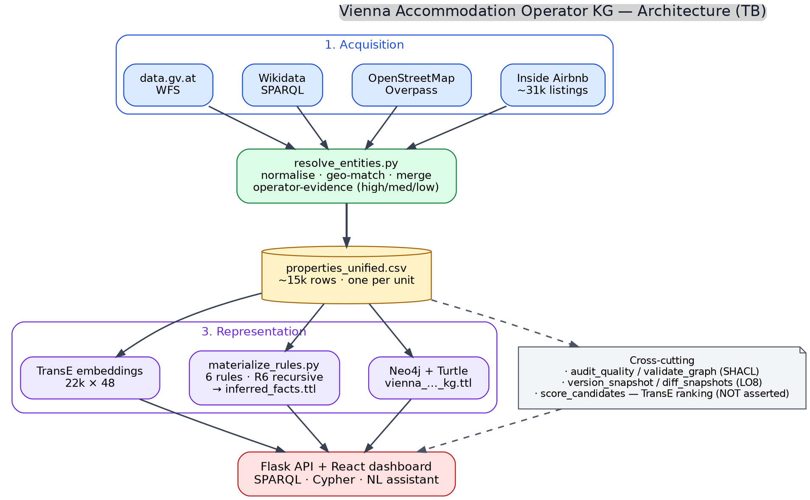

# Architecture

Portfolio reference: this document supports **LO5 — design and implement architectures of a Knowledge Graph**.

The Vienna Accommodation Operator KG is built as a four-layer pipeline that separates **acquisition**, **resolution**, **representation**, and **services**. Each layer has a single responsibility, writes deterministic artifacts to disk, and can be re-run in isolation. This is the design rationale behind every choice below: a reviewer or grader should be able to delete any intermediate artifact, rerun one step, and arrive at the same downstream output.



## Layered view

| Layer | Components | Inputs | Outputs |
|---|---|---|---|
| **1. Acquisition** | `download_airbnb.py`, `collect_osm.py`, `collect_wikidata.py`, `collect_datagv.py` | Inside Airbnb CSV, Overpass API, Wikidata SPARQL, data.gv.at WFS | `data/inside_airbnb_listings.csv`, `data/osm_hotels.json`, `data/wikidata_hotels.json`, `data/datagv_accommodations.csv` |
| **2. Resolution** | `resolve_entities.py` (normalisation, geographic candidate matching, source merge, operator-evidence classification) | the four raw datasets above | `data/properties_unified.csv` (single source-of-truth table, one row per unit, with provenance columns) |
| **3. Representation** | `build_graph.py` (Neo4j + Turtle), `materialize_rules.py` (forward chaining + recursive closure), `export_triples.py` + `train_embeddings.py` (TransE) | `properties_unified.csv` | `graph/vienna_accommodation_operator_kg.ttl`, `graph/inferred_facts.ttl`, `models/embeddings/transe_embeddings.npz` |
| **4. Services** | `webapp/app.py` (Flask API), `webapp/frontend/` (React dashboard), `src/queries.sparql`, `src/queries.cypher`, `webapp/query_templates.py` (NL assistant) | RDF + embeddings + rule facts | operator exploration, candidate ranking, evolution diffs, NL queries, evidence panels |

Three cross-cutting concerns sit alongside the four main layers:

- **Quality** — `audit_quality.py` and `validate_graph.py` (SHACL via pyshacl) produce `reports/quality/data_quality_report.md` and `reports/quality/shacl_validation_report.txt`. They run on the resolved table and the asserted graph respectively.
- **Evolution** — `version_snapshot.py` writes `data/snapshots/<timestamp>/` with copies of the unified CSV, rule summary, embedding metrics, candidate scores, and RDF graph. `diff_snapshots.py` produces `reports/evolution/evolution_report.md` from the last two snapshots. This is the LO8 mechanism.
- **Scoring / ranking** — `score_candidates.py` reuses the trained TransE embedding to rank weak listing↔establishment candidates and operator↔operator similarities. The output is **never** added to the asserted graph: it is exposed only as a ranked list (`reports/ml/candidate_scores.csv`) for human review.

## Regenerating the diagram

The PNG is produced by graphviz from `docs/architecture.dot`. The DOT source and
the script that drives it are both in this folder. To regenerate:

```bash
python docs/render_architecture.py
```

This writes `docs/architecture.dot` and `docs/architecture.png`. The DOT file is
checked in so a reviewer can re-render at any DPI or convert to SVG/PDF with:

```bash
dot -Tsvg docs/architecture.dot -o docs/architecture.svg
dot -Tpdf docs/architecture.dot -o docs/architecture.pdf
```

## Design rationale

- **Why two RDF files (asserted vs inferred).** A reviewer must be able to distinguish facts that came from a source from facts derived by a rule. Mixing them in one Turtle file would make this impossible without inspecting provenance per triple. Keeping `inferred_facts.ttl` separate lets a SPARQL user union them explicitly (see `src/queries.sparql`) or use only the asserted base.
- **Why both Neo4j and RDF.** Neo4j is the interactive query backend for the dashboard (low-latency Cypher traversals on operator → unit → district paths). RDF/Turtle is the portable, citable export with explicit class hierarchy (`ontology/accommodation_operator.owl`) and SHACL shapes (`ontology/accommodation_operator_shapes.ttl`). They share the same canonical IDs.
- **Why the embedding ranking is not asserted.** TransE on 6 epochs/CPU has `hits@10 ≈ 0.26`. That is useful as a ranking signal over the ~1 100 weak listing↔establishment candidates that the symbolic layer refuses to assert, but it is not strong enough to add edges to the graph automatically. The dashboard surfaces TransE-ranked suggestions for human review only.
- **Why a single resolved CSV.** Every downstream artifact (graph, ontology validation, rules, embeddings, snapshots) reads from `properties_unified.csv`. Snapshotting that one file is enough to reproduce the rest of the layer-3 outputs, which is what makes the LO8 evolution diff cheap to produce.

## Reproducibility

The full pipeline is one command:

```bash
python src/run_pipeline.py            # full (needs Neo4j)
python src/run_pipeline.py --skip-neo4j   # everything else
```

Every file shown in `architecture.png` is regenerated deterministically from the four raw inputs.
